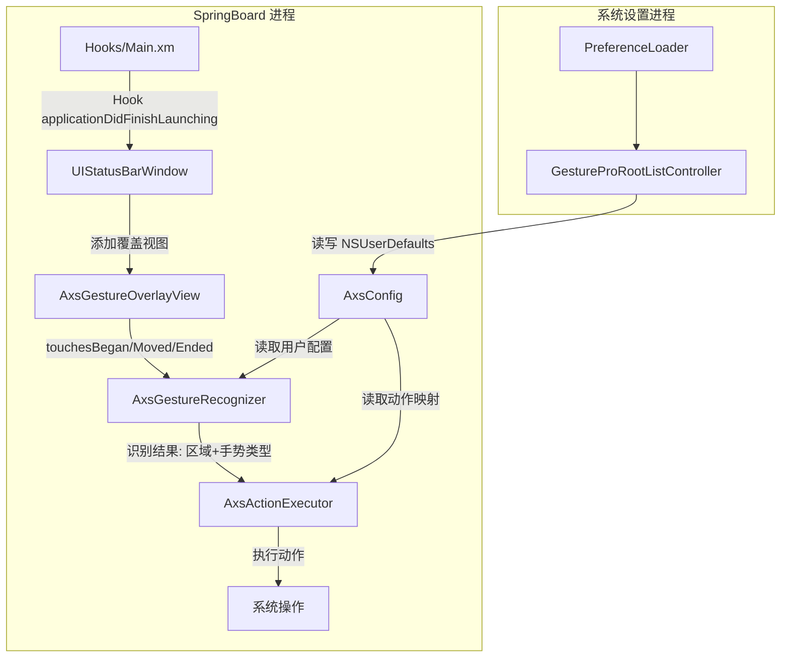

## 产品概述

将现有 GesturePro（iOS 17 Action Button 插件）完全重写为面向 iOS 16.5 的状态栏手势插件。插件在 SpringBoard 状态栏上覆盖透明手势识别层，将状态栏等分为左/灵动岛/右三个区域，每个区域独立识别单击、双击、长按、左滑、右滑五种手势（共 15 个可配置动作）。用户通过系统设置中的 PreferenceLoader 入口配置每个手势绑定的系统动作。

## 核心功能

- **状态栏三区手势**：左区（0-33%宽度）、灵动岛区（33%-67%）、右区（67%-100%），每个区域独立配置
- **五种手势识别**：单击（< 0.3s 单点）、双击（两次快速点击 < 0.35s 间隔）、长按（> 0.5s 保持）、左滑（水平左移 > 30pt）、右滑（水平右移 > 30pt）
- **16+ 系统动作**：截图、锁屏、主屏幕、多任务、控制中心、通知中心、手电筒、静音切换、Siri、旋转锁定、打开App、快捷指令、Shell命令、注销、安全模式、重启
- **PreferenceLoader 设置面板**：独立系统设置入口，每区域/每手势选择绑定动作
- **Rootless 兼容**：Dopamine 2 无根越狱环境，支持 roothide 方案

## 技术栈

- **语言**：Objective-C / Logos（Theos 编译框架）
- **注入目标**：SpringBoard（com.apple.springboard）
- **越狱框架**：Cydia Substrate / libhooker
- **设置面板**：PreferenceLoader + PSListController
- **Rootless 路径**：roothide 库（jbroot 路径转换）
- **编译工具链**：Theos (roothide/theos)，iOS 16.5 SDK，arm64

## 实现方案

### 触摸拦截策略

在 SpringBoard 启动完成后，获取 `UIStatusBarWindow`（iOS 16 中状态栏专属窗口），在其上添加一个透明的 `UIView` 覆盖层，`userInteractionEnabled = YES`。通过重写该覆盖视图的 `touchesBegan:/Moved:/Ended:` 方法捕获原始触摸事件，构建手势状态机。

**选择覆盖视图而非 hook sendEvent 的原因**：

- 避免拦截全局事件造成性能损耗和兼容性问题
- 覆盖视图只在状态栏区域内生效，不影响其他 UI
- 视图层级管理清晰，启用/禁用只需移除/添加视图

### 手势状态机模型

```
触摸开始 → 记录坐标 + 时间戳
   ├─ 0.3s 内抬起且无第二次点击 → 单击
   ├─ 0.35s 内第二次点击并抬起 → 双击
   ├─ 0.5s 未抬起 → 长按
   └─ 水平移动 > 30pt → 左滑/右滑（方向判断）
```

### 架构设计



### 数据流

1. 用户触摸状态栏覆盖视图 → `AxsGestureOverlayView` 捕获触摸坐标和时间
2. 坐标映射到区域（按屏幕宽度三等分）
3. `AxsGestureRecognizer` 状态机判断手势类型
4. 从 `AxsConfig` 读取该区域+手势对应的动作 key
5. `AxsActionExecutor` 执行对应系统操作

### 配置存储设计

| 配置 Key | 类型 | 示例值 | 说明 |
| --- | --- | --- | --- |
| `enabled` | BOOL | YES | 插件总开关 |
| `statusbar.left.tap` | NSString | `screenshot` | 左区单击动作 |
| `statusbar.left.double` | NSString | `lockscreen` | 左区双击动作 |
| `statusbar.left.long` | NSString | `homescreen` | 左区长按动作 |
| `statusbar.left.swipeLeft` | NSString | `appswitcher` | 左区左滑动作 |
| `statusbar.left.swipeRight` | NSString | `controlcenter` | 左区右滑动作 |
| `statusbar.island.tap` | NSString | ... | 灵动岛区（同结构） |
| `statusbar.right.tap` | NSString | ... | 右区（同结构） |


共 15 个动作 key（3 区域 × 5 手势），值统一为动作标识符字符串。

## 实现要点

### 性能考量

- 覆盖视图仅在启用时创建，禁用时移除，不常驻内存
- 触摸处理在主线程轻量执行（时间戳+坐标判断），无复杂计算
- 动作执行使用 `dispatch_async` 异步执行，不阻塞主线程触摸响应链
- 配置读取每次新建 `NSUserDefaults(suiteName:)` 保证跨进程同步

### Rootless 适配

- jbroot 路径函数使用 `roothide` 库的 `jbroot()` 宏
- 设置面板 Resources 路径使用 `[NSBundle bundleForClass:]` 自动定位
- deb 包使用 `THEOS_PACKAGE_SCHEME=rootless` 编译

### 兼容性保障

- `prepareSpringBoardRuntime` 运行时检测关键类存在性，不存在的 iOS 版本直接返回 NO
- 手势覆盖视图层级不影响系统状态栏原始交互（时间、电池等仍可点击穿透）
- 设置面板中不可用的动作（如 iPhone 14 Pro 无操作按钮）自动灰显

## 目录结构

```
ActionGesture/（工程根目录）
├── control                              # [MODIFY] 包描述文件，更新 Name/Version/Depends/Package
├── Makefile                             # [MODIFY] 编译配置，按新框架重写 THEOS 变量
├── GesturePro.plist                     # [MODIFY] 注入过滤器，保持 SpringBoard + Preferences
├── build.sh                             # [MODIFY] 编译脚本，支持 rootful/roothide/rootless 三版本
├── README.md                            # [MODIFY] 更新项目说明
├── .github/workflows/build.yml          # [MODIFY] CI 版本号前缀更新
│
├── Hooks/                               # [NEW] 核心 hook 实现目录
│   └── Main.xm                          # [NEW] SpringBoard hook：启用时创建状态栏手势覆盖视图
│
├── Headers/                             # [NEW] 私有类/协议声明
│   └── AxsPrivate.h                     # [NEW] 声明 UIStatusBarWindow 等 iOS 16 私有类、手势/动作常量宏
│
├── Sources/                             # [NEW] 业务层（纯 OC）
│   ├── AxsConfig.h                      # [NEW] 配置读取层头文件：enabled + 15 个手势动作属性
│   ├── AxsConfig.m                      # [NEW] 配置读取层实现：NSUserDefaults 读写 + registerDefaults
│   ├── AxsGestureRecognizer.h           # [NEW] 手势识别器头文件：区域枚举、手势枚举、状态机回调协议
│   ├── AxsGestureRecognizer.m           # [NEW] 手势识别器实现：touches 状态机 + 双击/长按时序判断
│   ├── AxsActionExecutor.h              # [NEW] 动作执行器头文件：16+ 动作方法声明
│   ├── AxsActionExecutor.m              # [NEW] 动作执行器实现：截图/锁屏/主屏幕/多任务等系统操作
│   └── AxsGestureOverlayView.h          # [NEW] 状态栏覆盖视图头文件
│
├── GestureProprefs/                     # [NEW] PreferenceLoader 设置面板子项目
│   ├── Makefile                         # [NEW] 子项目编译配置（PreferenceBundle）
│   ├── GestureProRootListController.h   # [NEW] 列表控制器头文件
│   ├── GestureProRootListController.m   # [NEW] 列表控制器实现：加载 Root.plist + 关于我们卡片
│   ├── Resources/
│   │   └── Root.plist                   # [NEW] 设置面板界面定义：15 项动作选择的 PSLinkListCell
│   └── entry.plist                      # [NEW] PreferenceLoader 入口描述
│
└── layout/                              # [MODIFY] 资源文件（多语言 strings、bundle Info.plist）
    └── Library/Application Support/
        └── GesturePro.bundle/           # [MODIFY] 重命名 bundle 目录名称
            ├── Info.plist               # [MODIFY] bundle 标识更新
            ├── en.lproj/
            ├── zh-Hans.lproj/
            └── ... (多语言 strings)
```

### 文件清理

以下旧文件需要删除（iOS 17+ 专用代码，完全不可复用）：

- `GesturePro.xm` → 替换为 `Hooks/Main.xm`
- `GestureProSettings.xm` → 替换为 `GestureProprefs/` 子项目
- `GestureProHelper.h` / `GestureProHelper.m` → 功能拆分到 `Sources/AxsConfig.m` + `AxsGestureRecognizer.m` + `AxsActionExecutor.m`
- `GestureProHeaders.h` → 替换为 `Headers/AxsPrivate.h`

## Agent Extensions

### Skill

- **ios-tweak-scaffold**
- 用途：按照统一框架规范搭建工程脚手架，生成 control、Makefile、plist、Hooks/、Headers/、Sources/、设置面板子项目的完整骨架代码，确保遵循 Axs 前缀约定、PreferenceLoader 标准、Rootless 兼容等规范
- 预期成果：生成完整的项目文件结构，所有文件符合 ios-tweak-scaffold 框架约定，可直接编译